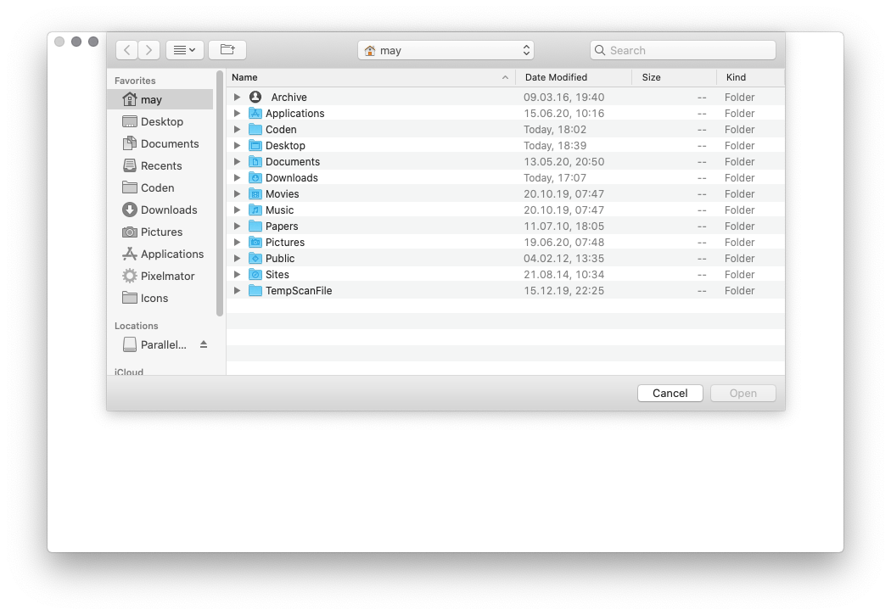

# SwiftMVC


Swift 5 library to easily set up a MVC design pattern with any SwiftUI App

## Description

SwiftUI makes it very easy to set up a proper Model-View-Controler pattern for apps. But doing so requires a lot of boilerplate code for every new app. So, this library contains all that in order to get startet with the real app as quick as possible.

### Features

* Multi Window Apps on iOS & macCatalyst
* Controller classes per App instance and per Window
    * Error Handling
    * Recent Files
    * App Menus
    * Open Files Dialog
* View classes to make live easier
    * Drop Zones for Drang & Drop
    * Select & Multiselect items
    * In-App Notificatoins (to confirm user-initiatedactions)

## Documentation

### Getting Started

With the swift package manager, add the library to your dependencies
```swift
dependencies: [
.package(url: "https://github.com/brampf/swiftmvc.git", from: "0.1.0")
]
```

then simply add the `MVC` import to your target

```swift
.target(name: "YourApp", dependencies: ["MVC"])
```

#### Xcode
Add the packet to your Xcode project and Xcode will automatically import the library


### Set up a new App
Since SwiftMVC handles the whole Scene configuration stuff, make sure that the info.plist does only contain the `UIApplicationSupportsMultipleScenes` key and nothing else. Otherwise make sure, that the scenes in there match the scenes defined in your App delegate (see below)

A naked project should look like this:


#### Scene Configuration
```xml
<key>UIApplicationSceneManifest</key>
<dict>
    <key>UIApplicationSupportsMultipleScenes</key>
<true/>
</dict>
```


#### Project Structure
As a minimum, you need to create 3 swift files: 
1. The `AppController` which needs to be an `ObservalbeObject`
2. The `WindowController` which also needs to be an `ObservableObject`
3. The `RootView` of your App which is an SwiftUI `View`

The controller will automatically be injected as `EnvironmentObjects` in the view, the `AppController` as shared instance between all windows and `WindowController` with seperate instance per window in a multi-window-environment.  

#### AppDelegate
Now, set up the whole SwiftMVC app in your AppDelegate by adding the inheritance from `SceneConfiguration` as well as the `ApplicationDelegate`. This will make sure, that the library injects the proper scene configuration and window controllers in your App 

```swift
import MVC
import UIKit

@UIApplicationMain
class AppDelegate: ApplicationDelegate<AppController>, UIApplicationDelegate, SceneConfiguration {


func application(_ application: UIApplication, didFinishLaunchingWithOptions launchOptions: [UIApplication.LaunchOptionsKey: Any]?) -> Bool {
// Override point for customization after application launch.
return true
}

// MARK: UISceneSession Lifecycle

func application(_ application: UIApplication, configurationForConnecting connectingSceneSession: UISceneSession, options: UIScene.ConnectionOptions) -> UISceneConfiguration {
// Called when a new scene session is being created.
// Use this method to select a configuration to create the new scene with.
// return UISceneConfiguration(name: "Default Configuration", sessionRole: connectingSceneSession.role)
self.sceneForActivity(activity: options.userActivities.first?.activityType ?? "")
}

func application(_ application: UIApplication, didDiscardSceneSessions sceneSessions: Set<UISceneSession>) {
// Called when the user discards a scene session.
// If any sessions were discarded while the application was not running, this will be called shortly after application:didFinishLaunchingWithOptions.
// Use this method to release any resources that were specific to the discarded scenes, as they will not return.
}

var scenes: Set<SceneSetup> {
return .init(arrayLiteral: self.mainScene)
}

var mainScene: SceneSetup = SceneSetup("swiftMVC.app.default", name: "Default Configuration", role: .windowApplication, delegate: WindowSceneDelegate<DemoApp.WindowController, DemoApp.AppController, DemoApp.WindowRootView>.self)

}

```
**That's it. Build & Launch the app**

### Open Files
The `WindowController` handles errors as well as opening files the following code will open an dialog asking for one image
```swift
Button("OPEN"){
    let picker = DocumentPickerViewController(false, UTIHandler("public.image", onError: self.windowControl.publishFail(_:), onOpen: .URL(onOpen: self.windowControl.open(url: ))))
    if let window = self.windowControl.window?() {
        picker.show(window: window)
        } else {
            picker.show()
        }
    }
}
```


Alternatively, you can use the `DropArea` View to simply drang & drop files onto it
```swift
DropArea(UTIHandler("public.image", onError: self.windowControl.publishFail(_:), onOpen: .URL(onOpen: self.windowControl.open(url: ))))
```


Both use the same `UTIHandler` strucutre which will will call the given `onOpen` method for each file provided. 

### Error Handling
Errors and error messages are handeled as `Fail` via the `publishFail` methods in the Controller classes. In order to present it, just use the `FailSummary` View, which will set the binding to `nil` when closed via the "x"

```swift
.popover(item: self.$windowControl.fail) { fail in
    FailSummary(item: self.$windowControl.fail)
}
```


### Showing App Info
Sometimes it comes in handy to show some information about your app via the `AppInfo` View:

```swift
AppInfo(Image(systemName: "gear"), name: AppDelegate.appName, version: AppDelegate.appVersion, build: AppDelegate.buildNumber)
```


### Popup Notifications
Especially with key controls, it's sometimes nice to confirm user interactions with a small dialog which will vanish by itself. This can be set as `NotificationView` on the `WindowController`

First, add the `PopupNotification` in the View you like
```swift
ZStack{
    // your View goes here

    if windowControl.note != nil {
        PopupNotification(self.$windowControl.note)
    }
}
```

All you then have to do, is trigger the notification for user interaction like clicking a button:
```swift
Button("Notification"){
    self.windowControl.note = NotificationView(.LONG, image: Image(systemName: "lightbulb"), title: "Notification", subtitle: "Confirm user interaction")
}
```


## License

MIT license; see [LICENSE](LICENSE.md).
(c) 2020 Max Schroeder
